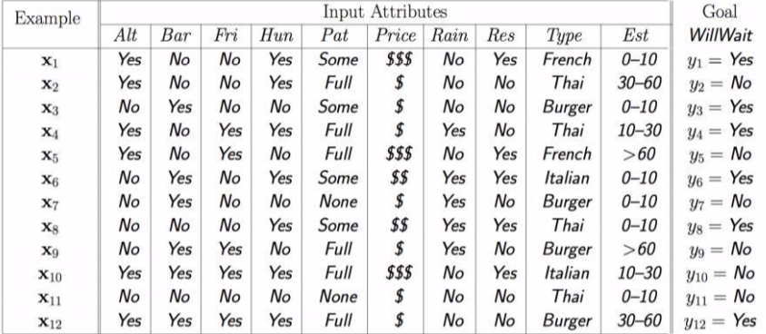
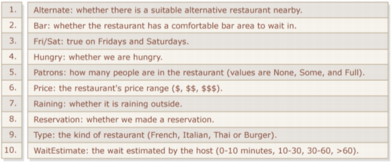

# Decision_Tree_Model
Implementation of a **decision tree** method (both by using scikit-learn library, and from scratch) on a dataset from a local restaurant in Python.

<h2>Model From Scratch:</h2>

The initial dataset is as follows:





I put the data from the restaurant intp **pandas dataframe** as follows:

```ruby
data = {'Alt':['yes','yes','no','yes','yes','no','no','no','no','yes','no','yes'],
        'Bar':['no','no','yes','no','no','yes','yes','no','yes','yes','no','yes'],
        'Fri':['no','no','no','yes','yes','no','no','no','yes','yes','no','yes'],
        'Hun':['yes','yes','no','yes','no','yes','no','yes','no','yes','no','yes'],
        'Pat':['some','full','some','full','full','some','none','some','full','full','none','full'],
        'Price':[3,1,1,1,3,2,1,2,1,3,1,1],
        'Rain':['no','no','no','yes','no','yes','yes','yes','yes','no','no','no'],
        'Res':['yes','no','no','no','yes','yes','no','yes','no','yes','no','no'],
        'Type':['french','thai','burger','thai','french','italian','burger','thai','burger','italian','thai','burger'],
        'Est':[1,3,1,2,4,1,1,1,4,2,1,3],
        'y':['yes','no','yes','yes','no','yes','no','yes','no','no','no','yes']
        }

df = pd.DataFrame(data,columns=['Alt','Bar','Fri','Hun','Pat','Price','Rain','Res','Type','Est','y'])
```

Now, for making the tree, I use the **mutual information** formula.

Since H(y) is the same in entropies for all of the features, I only calculate the **conditional entropy**: H(y|x) and by minizing it, I find the nodes at each level of the tree.

The below function in the code, calculates H(y|x) for each feature:

```ruby
def conditional_entropy(df,feature)
```

Next, I define a function that finds the next node with minimum H(y|x). Then, I define the final functin which implements the entire tree by using the above functions.

The final function is:

```ruby
def buildTree(df,tree=None)
```

The implemented tree is as follows:

{'Pat': {'full': {'Hun': {'no': 'no',
                          'yes': {'Type': {'burger': 'yes',
                                           'italian': 'no',
                                           'thai': {'Fri': {'no': 'no',
                                                            'yes': 'yes'}}}}}},
         'none': 'no',
         'some': 'yes'}}

As it can be seen from the above tree, by calculating the entropy of each feature at each level, the first node is the 'pat' feature, then it is 'hun', then 'type' and finally 'fri'.

<h2>Model Using scikit-learn:</h2>

I use the packages for decision tree implementation as below, and it can be seen that the results are the same as the previous part.

```ruby
clf = DecisionTreeClassifier()
clf = clf.fit(X_train,y_train)
y_pred = clf.predict(X_test)
```
         
         
